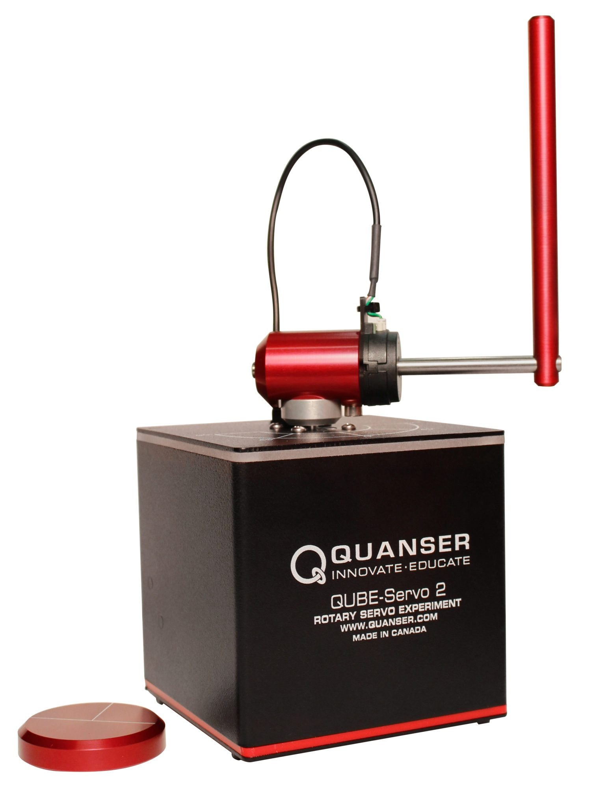

# Quanser Qube - Servo2 sim
For more information about the Qube click [here](https://www.quanser.com/products/qube-servo-2/)



## Simulator structure
```
├── README.md
├── qube_interfaces.py
├── qube_render.py
├── qube_simulator.py
└── requirements.txt
```

### reset_down()
Info:

- Reset starts the pendulum from the bottom (at rest).
- The task is to flip up the pendulum and hold it upright.
- Episode ends once the theta angle is greater than 90 degrees.
- Reward should be a function of the angles theta (arm angle) and alpha (pendulum), and the alpha angular velocity.
    - Encourages the the arm to stay centered, the pendulum to stay upright, and to stay stationary.


### reset_up()
Info:

- Reset starts the pendulum from the top (flipped up/inverted).
- The task is to hold the pendulum upright.
- Episode ends once the alpha angle is greater the 20 degrees or theta angle is greater than 90 degrees.
- Reward should be a function of the angles theta (arm angle) and alpha (pendulum), and the alpha angular velocity.
    - Encourages the the arm to stay centered, the pendulum to stay upright, and to stay stationary.

## Action
`action = Vm`

## States
`state = [theta, alpha, theta_dot, alpha_dot]`

## Usage

```

```
